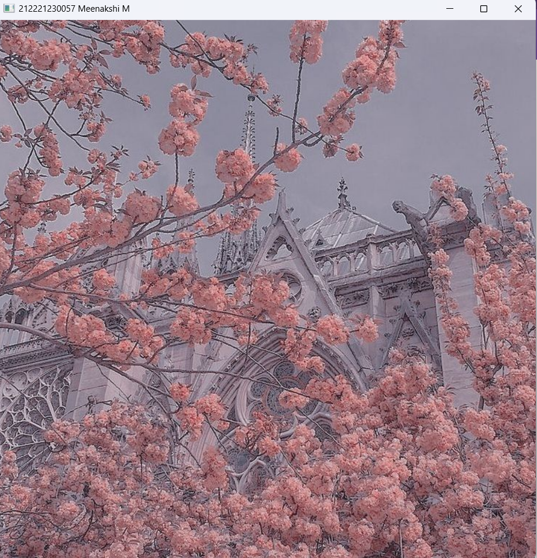
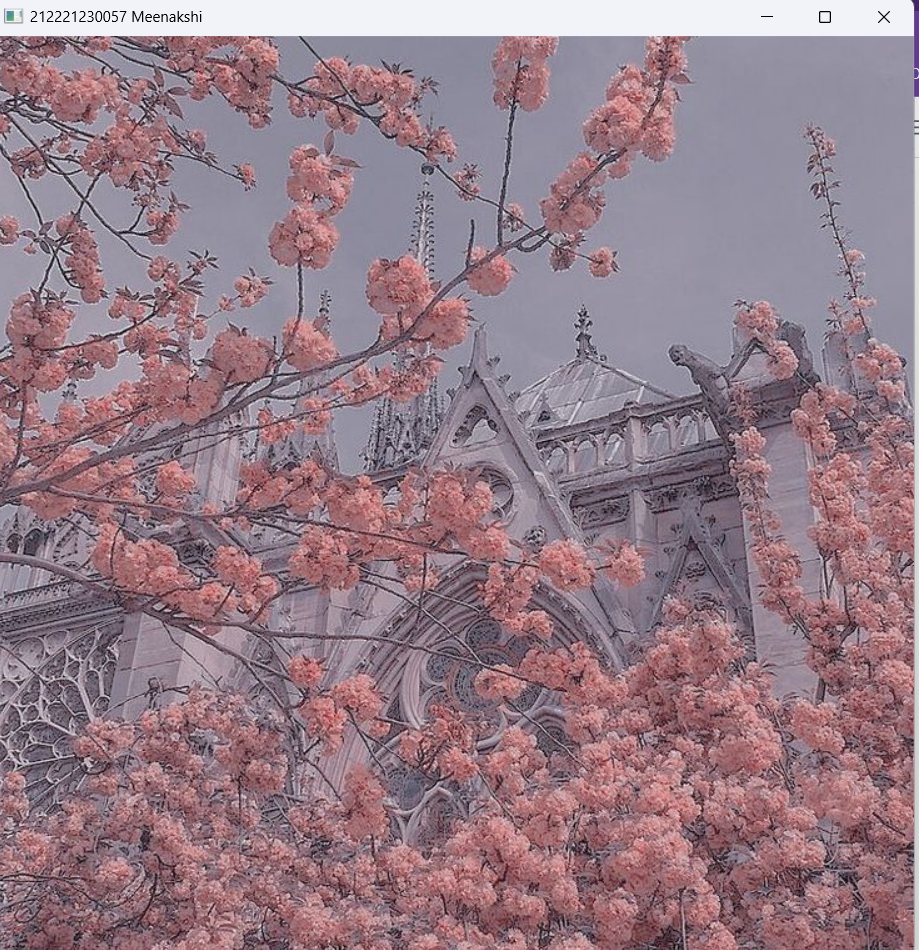
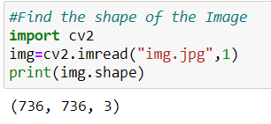
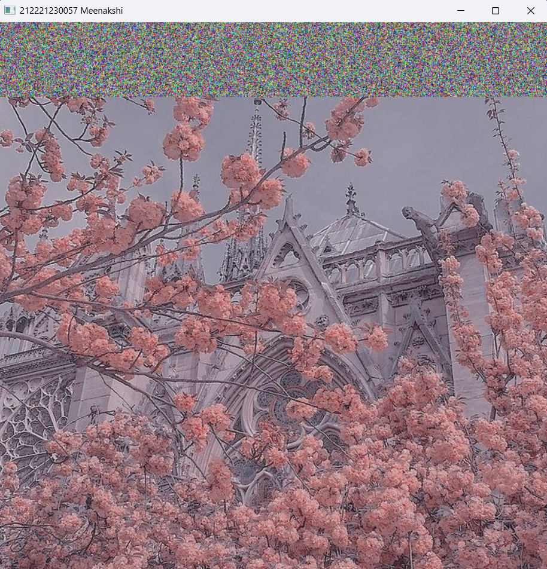
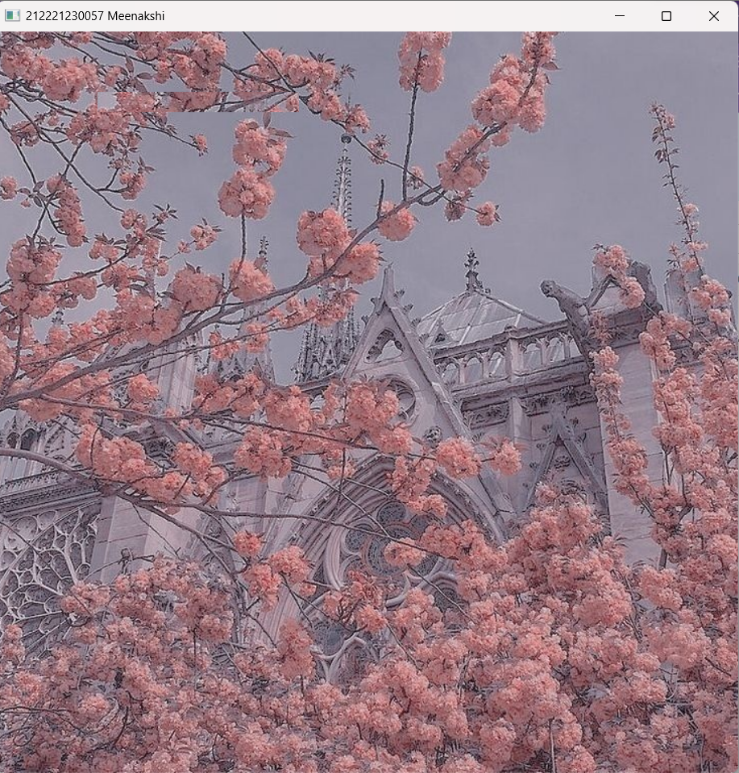

# READ AND WRITE AN IMAGE
## AIM
To write a python program using OpenCV to do the following image manipulations.
i) Read, display, and write an image.
ii) Access the rows and columns in an image.
iii) Cut and paste a small portion of the image.

## Software Required:
Anaconda - Python 3.7
## Algorithm:
### Step1:
Choose an image and save it as a filename.jpg
### Step2:
Use imread(filename, flags) to read the file.
### Step3:
Use imshow(window_name, image) to display the image.
### Step4:
Use imwrite(filename, image) to write the image.
### Step5:
End the program and close the output image windows.
## Program:
### Developed By: Meenakshi M
### Register Number: 212221230057

### i) To Read,display the image
```py
import cv2
img=cv2.imread("img.jpg",1)
cv2.imshow('212221230057 Meenakshi M',img)
cv2.waitKey(0)
```
### ii) To write the image
```py
import cv2 as cv
capture=cv.imread("img.jpg")
cv.imwrite("img.jpg",capture)
cv.imshow("212221230057 Meenakshi",capture)
cv.waitKey(0)
```
### iii) Find the shape of the Image python3
```py
import cv2
img=cv2.imread("img.jpg",1)
print(img.shape)
```
### iv) To access rows and columns python3
```py
import random
import cv2 as cv
capture=cv.imread("img.jpg")
for i in range(100):
    for j in range(capture.shape[1]):
        capture[i][j]=[random.randint(0,255),random.randint(0,255),random.randint(0,255)]
cv.imshow("212221230057 Meenakshi",capture)
cv.waitKey(0)

```
### v) To cut and paste portion of image python3
```py
import cv2
capture=cv2.imread("img.jpg",1)
tag=capture[260:280,100:300]
capture[60:80,100:300]=tag
cv2.imshow("212221230057 Meenakshi",capture)
cv2.waitKey(0)

```

## Output:

### i) Read and display the image


### ii)Write the image


### iii)Shape of the Image


### iv)Access rows and columns


### v)Cut and paste portion of image


## Result:
Thus the images are read, displayed, and written successfully using the python program.


